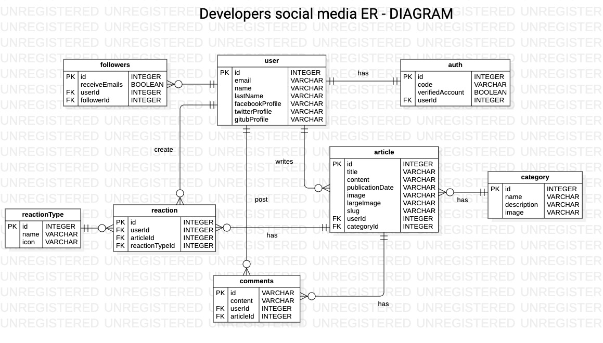

# Proyecto
## Integrantes

- Juan José Jaramillo
- Lesly Tipanluiza

## Descripción

El tema del proyecto es el desarrollo de una plataforma de tipo red social dedicada para desarrolladores.

Esta red social la hemos denominado: `Bloggy`.

Entre las funcionalidades más importantes tenemos:
 - Registro de usuarios
 - Publicación de artículos
 - Sistema de comentarios
 - Reacciones

## Recursos
### Trello

  Se ha utilizado una herramienta de gestión llamada Trello para mantener las actividades de todo el ciclo de vida del software de una forma dinámica y organizada:

  

### Figma
  Para el diseño de interfaces se utilizó la herramienta Figma, de igual forma se puede acceder al proyecto con el siguiente Link:

  

### Diagrama E-R
  El diagrama entidad relación se encuentra disponible dentro de la carpeta diagrams.

  